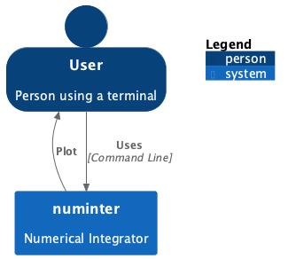
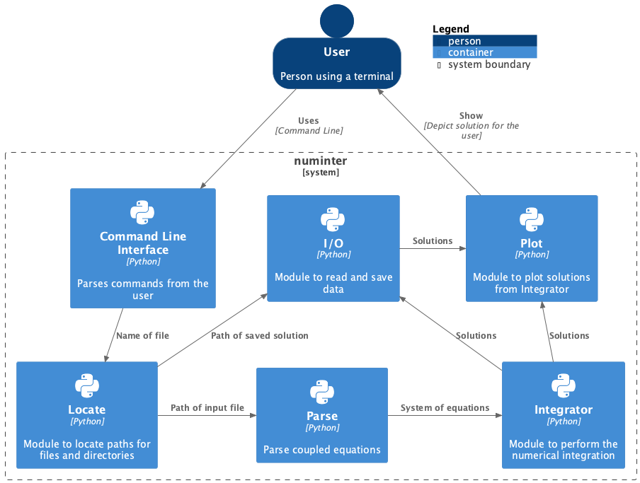

# Software design and architecture

Unfortunately I missed the lecture where we should do the code review 
and present our software using a flowchat. However, I prepared a flowchart
for our numerical integrator using `puml`. I used the C4 model to make
flowcharts of Level 1 and Level 2. Below is the puml code for the first, 
very simple level, and below that the flowchart.

```uml
@startuml numinter1
!include  https://raw.githubusercontent.com/plantuml-stdlib/C4-PlantUML/master/C4_Container.puml
!define DEVICONS https://raw.githubusercontent.com/tupadr3/plantuml-icon-font-sprites/master/devicons
!define FONTAWESOME https://raw.githubusercontent.com/tupadr3/plantuml-icon-font-sprites/master/font-awesome-5
!include DEVICONS/python.puml
!include DEVICONS/terminal.puml
!include FONTAWESOME/users.puml

SHOW_PERSON_OUTLINE()

Person(user, "User", "Person using a terminal")
System(system, "numinter", "Numerical Integrator")
Rel(user, system, "Uses", "Command Line")
Rel_L(system, user, "Plot",)

SHOW_FLOATING_LEGEND()
@enduml

```




For Level 2 we have the following puml code, with the associated flowchart

```
@startuml
!include  https://raw.githubusercontent.com/plantuml-stdlib/C4-PlantUML/master/C4_Container.puml
!include  https://raw.githubusercontent.com/plantuml-stdlib/C4-PlantUML/master/C4_Component.puml
!define DEVICONS https://raw.githubusercontent.com/tupadr3/plantuml-icon-font-sprites/master/devicons
!define FONTAWESOME https://raw.githubusercontent.com/tupadr3/plantuml-icon-font-sprites/master/font-awesome-5
!include DEVICONS/python.puml
!include DEVICONS/terminal.puml

SHOW_PERSON_OUTLINE()

Person(user, "User", "Person using a terminal")
System_Boundary(c1, "numinter", "Numerical Integrator") {
    Container(cli, "Command Line Interface", "Python", "Parses commands from the user", $sprite="python")
    Container(locate, "Locate", "Python", "Module to locate paths for files and directories", $sprite="python")
    Container(io, "I/O", "Python", "Module to read and save data", $sprite="python")
    Container(parse, "Parse", "Python", "Parse coupled equations", $sprite="python")
    Container(algo, "Integrator", "Python", "Module to perform the numerical integration", $sprite="python")
    Container(plot, "Plot", "Python", "Module to plot solutions from Integrator", $sprite="python")
}
Rel(user, cli, "Uses", "Command Line")
Rel(cli, locate, "Name of file")
Rel_R(locate, parse, "Path of input file")
Rel_R(parse, algo, "System of equations")
Rel_U(algo, plot, "Solutions")
Rel_U(plot, user, "Show", "Depict solution for the user")
Rel_U(algo, io, "Solutions")
Rel_R(io, plot, "Solutions")
Rel_U(locate, io, "Path of saved solution")

SHOW_FLOATING_LEGEND()
@enduml
```

 

How to interact with this software I urge you to visit [Numerical Intergrator](https://github.com/richarderikjohansson/Numerical_integration.git)
